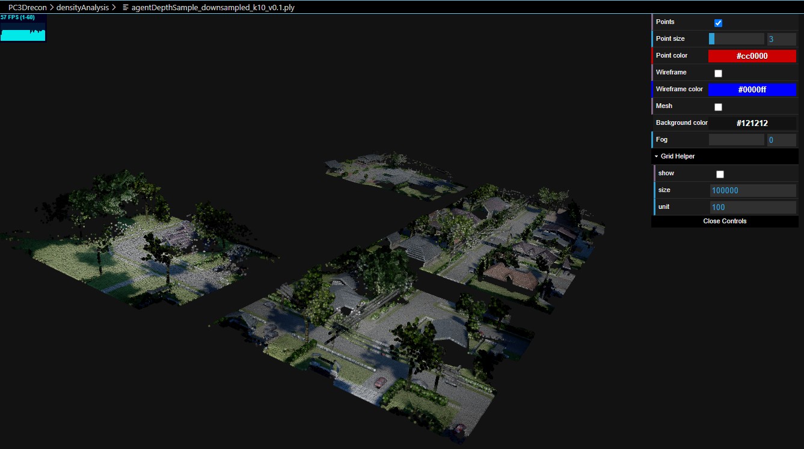
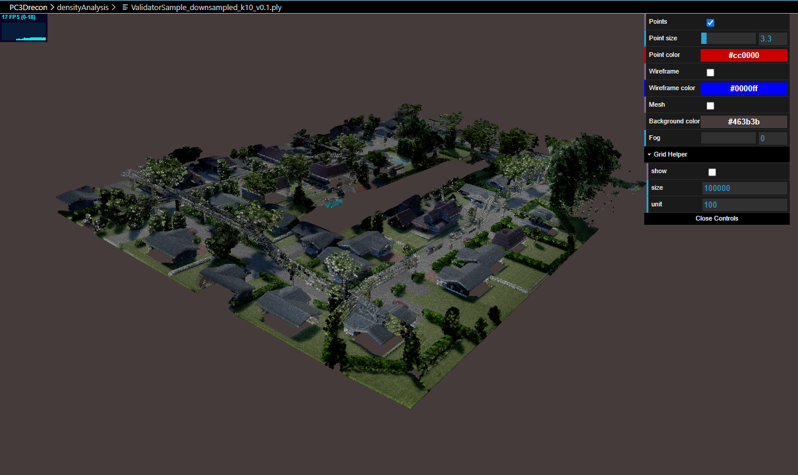
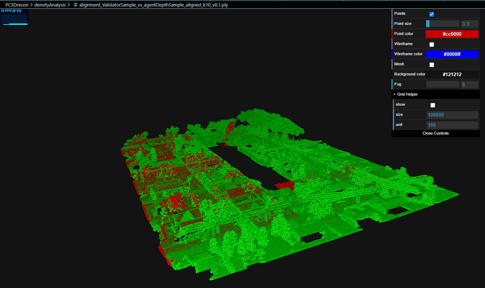
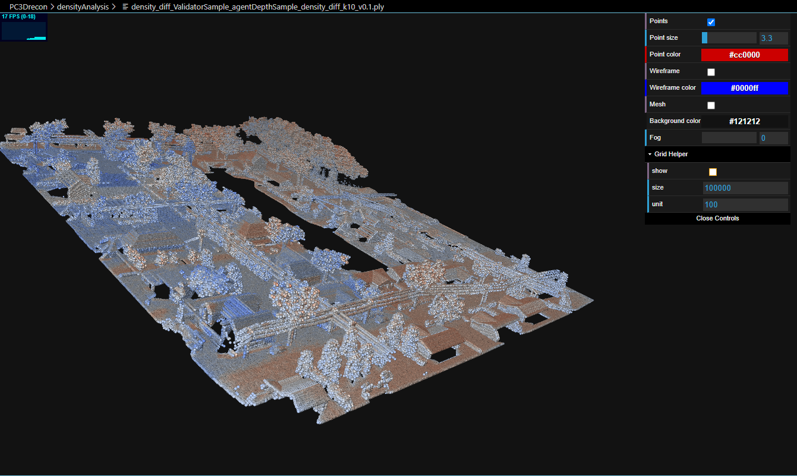
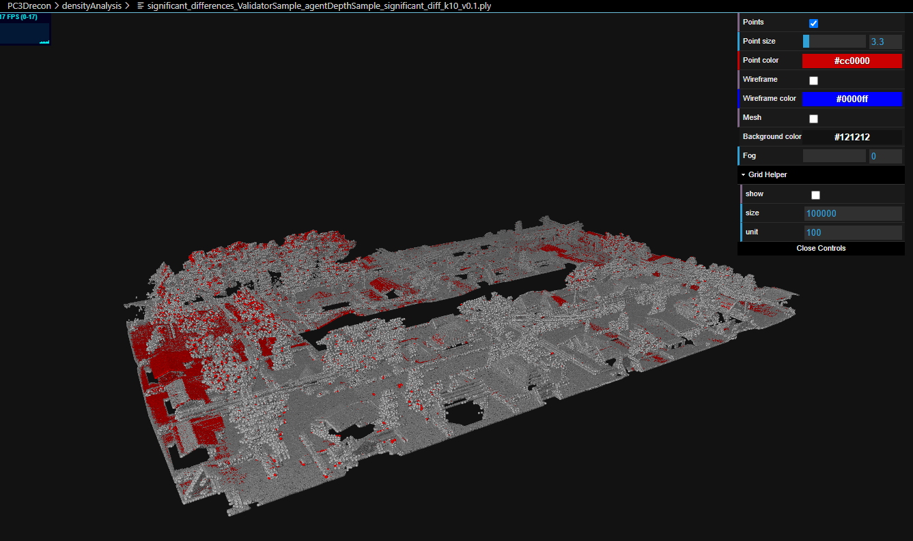

# Analyzing UAV Navigation Effectiveness Using Point Clouds

To assess UAV navigation effectiveness using point clouds generated from agent (actual UAV path) and validator (reference path) trajectories:

## 1. Generate and Downsample Point Clouds
   - Convert the recorded UAV and reference trajectories into point clouds.
   - Downsample the point clouds to improve processing efficiency.

## 2. Alignment Analysis
   - **ICP Alignment:** Align the agent's point cloud to the validator's using Iterative Closest Point (ICP).
   - **Metrics Evaluation:** 
     - **ICP Fitness:** Higher values indicate better alignment with the reference path.
     - **Inlier RMSE:** Lower values suggest closer alignment and higher navigation accuracy.

## 3. Overlap Assessment (IoU)
   - **Compute IoU:** Measure the overlap between the aligned point clouds to evaluate how closely the UAV followed the reference trajectory.

## 4. Density Analysis
   - **Compare Densities:** Analyze density distributions to detect regions where the UAV's path deviated from the expected route.
   - **Identify Significant Deviations:** Highlight areas with large density differences as potential navigation issues.

## 5. Visual and Quantitative Analysis
   - **3D Visualization:** Visualize the aligned point clouds with color coding to highlight deviations from the reference path.
   - **Calculate Metrics:** Measure the average and maximum distances between corresponding points to quantify path adherence.

## Applications
   - **Path Planning Evaluation:** Determine how well different path planning algorithms help the UAV follow the optimal trajectory.
   - **Obstacle Avoidance:** Detect deviations near obstacles to assess avoidance strategies.
   - **Control Performance:** Analyze stability and path adherence to optimize the UAV's control system.

This approach helps identify areas for improving path planning, control algorithms, and obstacle avoidance, enhancing overall UAV navigation effectiveness.

## Comparison Report between `ValidatorSample` and `agentDepthSample` (Generated by `pcChecks.py`)

### 1. ICP Alignment Metrics

#### a. ICP Alignment Fitness: 0.9174

**Definition:**

- **ICP (Iterative Closest Point):** An algorithm used to align two point clouds by minimizing the distance between their corresponding points.
- **Fitness:** Measures the ratio of inlier correspondences (i.e., point pairs considered good matches after alignment) to the total number of points in the source point cloud.

**Interpretation:**

- A Fitness value of 0.9174 (91.74%) indicates that approximately 91.74% of the points in the source point cloud (`agentDepthSample`) have been successfully aligned with corresponding points in the target point cloud (`ValidatorSample`).
- High Fitness (close to 1) suggests a good alignment where most points overlap or correspond well between the two point clouds.

#### b. ICP Inlier RMSE: 0.062948

**Definition:**

- **RMSE (Root Mean Square Error):** Measures the average distance between the corresponding inlier points after alignment.
- **Inliers:** Point pairs that are considered good matches during the alignment process.

**Interpretation:**

- An Inlier RMSE of 0.062948 indicates that, on average, the distance between matched points after alignment is approximately 0.063 units (e.g., meters).
- Lower RMSE values signify tighter alignment, meaning the points are very close to their corresponding matches.


### 2. Intersection over Union (IoU): 0.0503

**Definition:**

- **IoU:** Measures the overlap between two voxelized point clouds by calculating the ratio of the intersection to the union of the two voxel grids.

**Interpretation:**

- An IoU of 0.0503 (5.03%) is relatively low, indicating that there is only about 5% overlap between the two point clouds after alignment.

**Possible Reasons for Low IoU Despite High Fitness:**

1. **Partial Overlap:** The point clouds may cover different regions, resulting in minimal overlap even after alignment.
2. **Sparse Point Clouds:** Sparse data may naturally lead to lower overlap.
4. **Voxel Size Impact:** The voxel size (0.1) affects the IoU calculation. A larger voxel size might increase generalization, while a smaller size may be too restrictive.

---

### 3. Density Statistics

#### a. `ValidatorSample`

- **Minimum Density:** 0.123216
- **Maximum Density:** 16.076234
- **Mean Density:** 6.519501
- **Median Density:** 6.904722
- **Standard Deviation:** 1.795236

#### b. `agentDepthSample`

- **Minimum Density:** 0.093821
- **Maximum Density:** 14.136900
- **Mean Density:** 6.512427
- **Median Density:** 6.929007
- **Standard Deviation:** 1.819163

**Definition of Density:**

- **Point Density:** Represents how densely packed the points are in a region, calculated as the inverse of the average distance to the nearest `k` neighbors (`k=10`).

**Interpretation:**

- **Similar Mean and Median Densities:** Both point clouds have nearly identical mean (~6.5) and median (~6.9) densities, indicating similar overall point distribution.
- **Range of Densities:** 
  - `ValidatorSample` has a higher maximum density (16.076) than `agentDepthSample` (14.137), suggesting regions with more closely packed points.
  - `ValidatorSample` also has a higher minimum density, indicating fewer sparse regions.
- **Standard Deviation:** The standard deviations (~1.8) are similar, indicating comparable variability in density across both datasets.

### 4. Mapped Densities Statistics

- **Mean Mapped Density:** 3.092202
- **Median Mapped Density:** 2.029798
- **Standard Deviation:** 2.378365

**Interpretation:**

- Mapped densities represent the corresponding densities of `agentDepthSample` points when mapped to `ValidatorSample`.
- Lower mapped densities compared to original densities suggest that some areas in `agentDepthSample` have fewer closely packed points relative to `ValidatorSample`.

---

### 5. Density Difference Statistics

- **Mean Density Difference:** 3.427300
- **Median Density Difference:** 3.828485
- **Standard Deviation of Density Differences:** 2.711330

**Interpretation:**

- The mean and median density differences indicate moderate overall differences between the two point clouds.
- The high standard deviation of density differences suggests significant variability in how the two datasets differ.

### 6. Significant Differences

- **Number of Significant Differences:** 2,577,121
- **Proportion of Significant Points:** 27.77%

**Interpretation:**

- Approximately 27.77% of the points in the combined dataset exhibit significant density differences, indicating that a substantial portion of the `agentDepthSample` differs from the reference (`ValidatorSample`).

---

### Overall Insights

- **Good Alignment (ICP Fitness):** The high ICP fitness indicates a successful alignment, with most points corresponding well between the two datasets.
- **Low IoU:** Despite the good alignment, the low IoU suggests the point clouds do not cover the same regions extensively, or they may have different densities.
- **Similar Density Distributions:** The comparable density statistics suggest the two datasets have a similar level of point detail, but the significant differences point to specific regions where the trajectories diverge.

**Potential Applications:**

- **Path Planning Evaluation:** Identify regions where the `agentDepthSample` deviated significantly from the expected trajectory.
- **Control Performance Analysis:** Assess areas of dense deviations to improve UAV navigation algorithms.

# High level Algorithm for Point Cloud Comparison

1. Input Preparation
    - a. Load Point Clouds
        - Load `ValidatorSample` and `agentDepthSample` from their respective files (e.g., `.ply`, `.pcd`).
    - b. Downsample Point Clouds
        - Apply voxel downsampling to both point clouds using the specified voxel size (`v`).
        
        

2. Density Computation
    - a. Compute Point Densities
        - For each downsampled point cloud, compute the density of each point based on the average distance to its `k=10` nearest neighbors.
        - Density is calculated as the inverse of the mean distance to these neighbors.
    - b. Save Density Values
        - Save the computed densities for each point into separate files for future reference and analysis.

3. Point Cloud Alignment

    

    - a. Initial Alignment
        - Initialize the transformation matrix as an identity matrix.
    - b. Perform ICP Alignment
        - Execute the Iterative Closest Point (ICP) algorithm to align `agentDepthSample` (source) to `ValidatorSample` (target) using the initialized transformation.
    - c. Evaluate Alignment Quality
        - Calculate ICP Alignment Fitness and Inlier RMSE to assess the quality of the alignment.
    - d. Save Aligned Point Cloud
        - If the alignment quality exceeds a predefined threshold, apply the transformation to `agentDepthSample` and save the aligned point cloud.

4. Overlap Assessment
    - a. Compute Intersection over Union (IoU)
        - Voxelize both aligned point clouds using the same voxel size (`v`).
        - Compute the IoU by calculating the ratio of the volume of the intersection to the volume of the union of the two voxelized point clouds.

5. Reporting
    - a. Generate Comparison Report
        - Compile ICP alignment metrics (Fitness and Inlier RMSE), IoU, and density statistics for both point clouds into a structured text report.

6. Density Mapping and Difference Calculation
    - a. Map Densities
        - For each point in `ValidatorSample`, find the nearest corresponding point in `agentDepthSample` and map its density.
    - b. Compute Density Differences
        - Calculate the difference in density between corresponding points of the two point clouds.
    - c. Identify Significant Differences
        - Determine points with density differences exceeding twice the standard deviation to highlight significant discrepancies.
    - d. Save Density Difference Point Clouds
        - Create and save point clouds visualizing density differences, with significant differences highlighted in distinct colors (e.g., red for significant discrepancies).

7. Visualization (Optional)
    - a. Visualize Alignment and Differences

        Density Difference

        

        Significant Difference

        


---

# Algorithm for Point Cloud Comparison

# Point Cloud Comparison Algorithm

```
Input{Two point clouds: {ValidatorSample} and {agentDepthSample}}

Output{Comparison report with alignment metrics, IoU, and density statistics}


1. Input Preparation
   - Load {ValidatorSample} and {agentDepthSample}
   - Apply voxel downsampling with size (v)

2. Density Computation
   - Compute point densities using (k) nearest neighbors
   - Save computed densities for future reference

3. Point Cloud Alignment
   - Initialize transformation matrix as identity
   - Perform ICP alignment to match {agentDepthSample} to {ValidatorSample}
   - Evaluate alignment quality (Fitness and RMSE)
   - Save aligned point cloud if quality is sufficient

4. Overlap Assessment
   - Voxelize both point clouds with size (v)
   - Compute IoU (Intersection over Union)

5. Reporting
   - Generate report with alignment metrics, IoU, and density statistics

6. Density Mapping and Difference Calculation
   - Map densities from {agentDepthSample} to {ValidatorSample}
   - Compute density differences and identify significant discrepancies
   - Save visualizations of density differences

7. Visualization (Optional)
   - Use 3D viewers to inspect alignment and density differences.

```

# Complexity Analysis of the Point Cloud Comparison Algorithm

## Time Complexity Analysis

### 1. Input Preparation
   - Loading Point Clouds: Loading the point cloud data requires traversing all N points.
     - Complexity: O(N)
   - Downsampling Point Clouds: Applying a voxel grid filter to downsample involves processing each point.
     - Complexity: O(N)

### 2. Density Computation
   - Nearest Neighbor Search: For each point, finding the k nearest neighbors using a KD-tree has a complexity of O(log(N)). Repeating this for all N points gives:
     - Complexity: O(N * log(N))
   - Computing Densities: Calculating densities for all points involves O(k) operations per point.
     - Complexity: O(N * k)

### 3. Point Cloud Alignment (ICP)
   - ICP Alignment: The Iterative Closest Point (ICP) algorithm aligns the two point clouds over multiple iterations. Each iteration involves finding the nearest neighbor for each point, costing O(N * log(N)).
     - Total Complexity: O(I * N * log(N)), where I is the number of iterations.
   - Evaluating Alignment Quality: Computing the fitness and RMSE involves iterating over all points.
     - Complexity: O(N)

### 4. Overlap Assessment (IoU Calculation)
   - Voxelization: Assigning each point to a voxel requires iterating over all points.
     - Complexity: O(N)
   - Computing IoU: Calculating the Intersection over Union involves comparing the sets of occupied voxels.
     - Complexity: O(V), where V ≤ N

### 5. Reporting
   - Generating the Report: Producing the report involves summarizing metrics, which is constant time.
     - Complexity: O(1)

### 6. Density Mapping and Difference Calculation
   - Mapping Densities: For each point in one cloud, finding the nearest neighbor in the other cloud costs O(N1 * log(N2)), where N1 and N2 are the number of points in the two clouds.
   - Computing Density Differences: Calculating differences for N1 mapped densities.
     - Total Complexity: O(N1 * log(N2) + N1)

### 7. Visualization
   - Rendering the Point Clouds: Displaying the point cloud typically requires processing all N points.
     - Complexity: O(N)

## Summary of Time Complexities

| Step                                | Time Complexity                          |
|-------------------------------------|------------------------------------------|
| 1. Input Preparation            | O(N)                                     |
| 2. Density Computation          | O(N * log(N) + N * k)                    |
| 3. Point Cloud Alignment (ICP)  | O(I * N * log(N))                        |
| 4. Overlap Assessment (IoU)     | O(N)                                     |
| 5. Reporting                    | O(1)                                     |
| 6. Density Mapping and Difference Calculation | O(N1 * log(N2) + N1)                  |
| 7. Visualization                | O(N)                                     |

### Overall Time Complexity
The ICP alignment step dominates the algorithm's complexity, with a total time complexity of O(I * N * log(N)), where I is the number of iterations.

## Space Complexity Analysis

- Input Point Clouds: Storing the original and downsampled point clouds requires O(N) space.
- KD-tree: The KD-tree for nearest neighbor searches also uses O(N) space.
- Voxel Grid: For voxelization, the space needed is at most O(N).
- Intermediate Computations: Storing densities, alignment transformations, and mapped densities requires additional O(N) space.

### Total Space Complexity
The total space complexity is approximately O(N).

Remarks
Add Trajectory Path in 3D map
